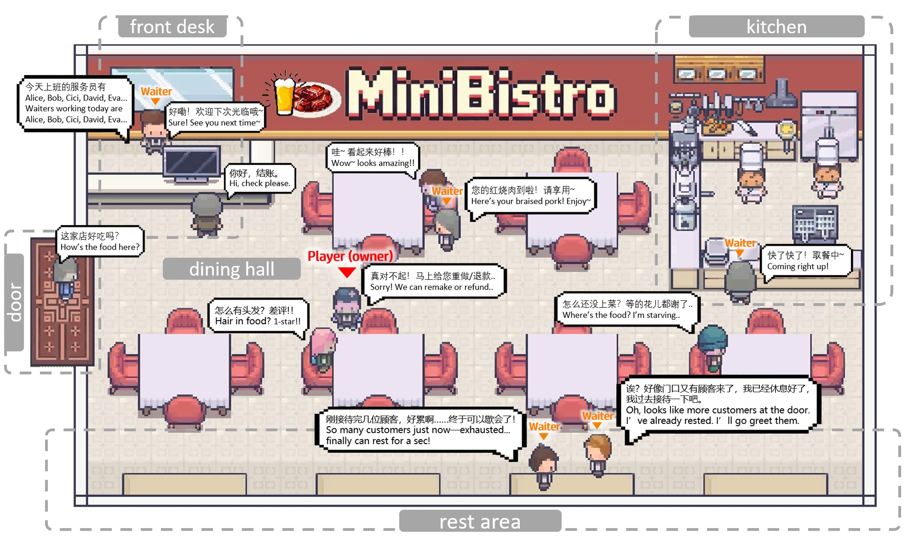

# MiniBistro: A business simulation game based on generative agents.

**This work is done at Shanghai Qi Zhi Institute under the supervision of Professor** [**Tianxing He**](https://cloudygoose.github.io/)


**MiniBistro** is a restaurant management/business simulation [game](#Directly Play) powered by Generative Agents. As the restaurant owner, you manage operations and build your reputation through natural language interactions with AI-driven waiters and customers. Game&Dialogue language: Chinese.


## 🎮 Overview

In MiniBistro, non-player characters (NPCs) are powered by Large Language Models (LLMs). Waiters make autonomous decisions based on their personality, backgrounds, game value(energy/mood) and memory. Customers have their own backgrounds, preferences, and base satisfaction, leading to dynamic and unpredictable interactions. This Unity-based 2D business simulation explores the future of AI-driven gameplay and emergent storytelling.

## ✨ Features

### 🤖 NPC Systems
- **Generative Waiters**: Each waiter has a unique personality, backstory, stat system (Energy, Mood, Tips) and memory that directly influences their LLM-driven decision-making (e.g., "Lin is a student doing part-time job." "Dong is an unemployed worker just trying to make a living." ).
- **Generative Customers**: Customers are pre-generated into libraries (Normal, All-Positive, All-Negative) with distinct base satisfications, personalities, preferences, and rich backstories that affect their behavior.
- **State Machines & LLM Fusion**: Waiters operate on a flexible state machine powered by LLM choices, while chefs use a fixed state machine to ensure gameplay stability. Customers use LLMs for key decisions like queuing, ordering, waiting, complaining, leaving and even emergence situations.

### 💬 Natural Language Interaction
- **Real-time Dialogue**: Engage in natural language conversations with both waiters and customers. Your words impact their mood and are stored in their long-term memory.
- **AI-mediated Ordering**: The ordering process is a multi-turn dialogue between the customer AI and waiter AI, where customers may chat and request off-menu items based on their preferences.
- **Emergency Resolution**: Step in as the manager when customers enter an "Emergency" state, using your conversational skills to resolve situations and prevent them from leaving.

### 🧠 Memory & Reflection Ecosystem
- **Comprehensive Memory Logs**: Every action, decision, and conversation is timestamped and logged into each NPC's memory.
- **Long-term Reflection**: Inspired by *Stanford Generative Agents *, multi-day memories are condensed into summaries and reflections, continuously shaping the Agent's future behavior and personality.

### ⏰ Simulation & Management
- **Strategic Staffing**: Before each day's business, you must select your team of waiters from a daily random subset of unique waiter agents. Your success hinges on strategically assessing their personalities, backstories, and stats to build the most effective team for the day's expected challenges.
- **Adjustable Time Scale**: Control the flow of time with adjustable timescale during the fixed business hours (18:00-22:00).
- **Procedural Challenges**: Three difficulty levels (Easy, Normal, Hard) affect customer spawn rate and the positivity/negativity ratio of the customer pool, testing your management skills.
- **End-of-Day Analytics**: Review daily performance with income reports and detailed AI-generated customer reviews.

## 🛠️ Installation

### Requirements
- Unity Editor Version: 2022.3 LTS
- A valid LLM API key (e.g., AzureOpenAI)

### Directly Play

1.  Clone the repository
2.  Replace with your own LLM API keys and settings in `./Playable demo/Config/AzureOpenAIConfig.json`

```json
{
  "endpoint": "your-endpoint",
  "deployment": "your-deployment", //e.g. gpt-4.
  "apiVersion": "your-apiVersion", //e.g. 2024-12-01-preview.
  "subscriptionKey": "your-subscriptionKey"
}
```
3.  Run `./Playable demo/MiniBistro.exe`

### Build Steps in Editor
1.  Clone the repository
2.  Open the project folder using Unity Hub.
3.  Replace with your own LLM API keys and settings in `./Config/AzureAPIConfig.json`
```json
{
  "endpoint": "your-endpoint",
  "deployment": "your-deployment", //e.g. gpt-4.
  "apiVersion": "your-apiVersion", //e.g. 2024-12-01-preview.
  "subscriptionKey": "your-subscriptionKey"
}
```
4.  Click "Play" in Editor, or Build and Run, as in "Directly Play"

## 🎯 How to Play

### Basic Controls

- Click waiter cards to select today's waiters and click the confirm button on the left to start today's business.
- Press `WASD` to move around, press `Space` to talk to your waiters(anytime) and customers(when they are in the state of emergency). Click on waiters or customers to check their detailed information..
- Press `Escape` to open the main menu. Click the corresponding button to achieve different game speeds and view today's dishes.

### Gameplay Loop

1.  **Staff Selection**: Before opening, choose your team of up to 3 waiters from a randomly generated pool of 8, each with unique AI personalities.
2.  **Observe & Intervene**: Watch the AI-driven simulation unfold. Use natural language to give orders to waiters or appease dissatisfied customers.
3.  **Handle Emergencies**: Be ready to directly interact with customers who are about to leave due to long waits or conflicts.
4.  **Review & Adapt**: After the day ends, analyze customer reviews to make better decisions for the next day.

## 📁 Project Structure
<pre>
MiniBistro/
├── Assets/
│   ├── Scripts/
│   │   ├── NPC/           # NPC core logic (Waiters, Customers, Chefs)
│   │   ├── Player/        # Player movement and interaction controller
│   │   ├── Managers/      # Game state, time, NPC spawning
│   │   ├── UI/            # User interface
│   │   └── API/           # AzureOpenAIManager.cs
│   ├── Scenes/            # Unity scenes
│   ├── Sprites/
│   ├── Prefabs/
│   └── StreamingAssets/   # API Key, JSON data (Waiters, Customers, Menu, etc.)
├── ProjectSettings/
└── Packages/
</pre>

This project relies on JSON files generated by Large Language Models to define game content and record simulation state. The structure of these files is central to the game's operation.

### Core Data Files (Pre-generated):
- **`Assets/StreamingAssets/Waiters/`**: Contains the pool of waiter characters with personalities, stats, and backstories.
- **`Assets/StreamingAssets/Customers/`**: Contains libraries of customer types (Normal, Positive, Negative).
- **`Assets/StreamingAssets/Menu/`**: Contains the available dishes, each with complexity levels that affect cooking time.

### Runtime Files (Generated during play):
- **`Assets/StreamingAssets/NPCMemories/`**: NPC memories are logged in JSON format during gameplay, forming their evolving memory.

## Data & Prompt Examples
This section provides concrete examples of the key JSON data structures and LLM prompts that drive the game's AI behavior.

**1. Waiter JSON Example**
```json
{
    "name": "刘志刚",
    "Energy": 92,
    "Mood": 50,
    "personalityType": "neutral",
    "story": "刘志刚三十出头，曾经在工地干过几年体力活，后来因为一次意外受伤转到餐厅做服务员。他对工作不上不下，认真完成，但并不热衷...",
    "story_eng": "Liu Zhigang is..."
}
```
**2. Customer JSON Example**
```json
{
    "name": "张浩",
    "baseMood": 46,
    "personalityType": "neutral",
    "story": "张浩四十出头，曾是一家机械厂的工人。工厂倒闭后，他靠零工维持生活。虽然日子拮据，但他仍保持对生活的韧劲...",
    "story_eng": "Zhang Hao is...",
    "favDishes": [ "红烧肉", "凉拌木耳" ]
}
```
**3. Memory Log Example**
```json
{
    "npcName": "董伟",
    "occupation": "服务员",
    "dailyMemories": [
        {
            "dayCount": 0,
            "saveDate": "2025-09-18 10:51:11",
            "memories": [
                "[17:00] 制定了今天的计划：16:00 - 准备餐厅\r\n16:30 - 营业阶段，服务客人\r\n22:30 - 清理准备打烊\r\n",
                "[17:28] 吴峰对你说：你好",
                "[17:28] 向吴峰回复说：你好，今天心情不太好。",
                "[18:05] 迎接顾客：欢迎光临，请问几位？",
                "[18:05] 带领顾客前往TablePosition2",
                "[18:07] 成功将顾客安排到TablePosition2",
                "[18:08] 为顾客点菜",
                "[18:14] 你对顾客说：您好，女士，欢迎光临！需要我为您推荐菜品吗？",
                "[18:22] 顾客对你说：当然，我很期待尝试这里的特色菜！有什么特别推荐的菜品吗？我总喜欢在我的博客上分享独特的美食体验。",
                "[18:32] 你对顾客说：推荐您尝试我们的“西红柿炒鸡蛋”，非常受欢迎！还有“红烧肉”也很特别哦！",
                "[18:44] 顾客说:“听起来很不错！我想要一份西红柿炒鸡蛋，期待看看它的特别之处！还有，请给我来一份红烧肉，感谢推荐！”并下单了西红柿炒鸡蛋，价格18元",
                "[18:54] 你对顾客说：好的，西红柿炒鸡蛋一份，马上为您准备！",
                "[18:54] 完成为顾客点菜，订单已确认",
                "[18:55] 完成点单，返回休息区",
                "[19:09] 收到通知：订单#2(西红柿炒鸡蛋)已完成，加入队列",
                "[19:47] 前往厨房取餐：西红柿炒鸡蛋",
                "[19:51] 为吴婷送上西红柿炒鸡蛋",
                ...
            ]
        }
    ]
}
```
**4. Prompt Examples**
    Waiter Decision Prompt

```csharp
max_tokens = 200,
temperature = 0.8f
```
```csharp
string prompt = $@"作为{npcName}（{occupation}），基于以下情况决定下一步行动：
时间：{currentTime}
状态：{statusInfo}
环境情况：
{environmentInfo}
最近记忆：
{currentMemory}

请基于你的性格（{personality}）选择最合适的行动：
1. 上菜任务有最高优先级！如果有订单需要上菜，你必须选择SERVE！
2. 如果有顾客在门口且无人迎接，可以考虑选择GREET
3. 如果没有紧急任务，可以选择IDLE休息

可选行动：
- GREET: 迎接顾客（包含后续的点菜）
- SERVE: 上菜服务
- IDLE: 空闲/休息

请返回JSON格式：
{{
  ""action"": ""行动名称"",
  ""dialogue"": ""如果需要说的话"",
  ""reason"": ""选择此行动的理由""
}}";
```
Customer Dialogue Prompt
```csharp
max_tokens = 1000,
temperature = 0.7f
```

```csharp
string prompt = $@"顾客{customer.customerName}正在餐厅，服务员说：'{waiterMessage}'
顾客信息：
- 性格：{customer.personality}（积极/消极/普通）。
- 背景：{customer.story}
- 喜爱菜品：{string.Join(",", customer.favoriteDishes)}
- 以往用餐记录：{string.Join("\n", customer.memoryList)}
- 对话记录：{string.Join("\n", customer.dialogueHistory)}
- 周围餐桌信息：{otherTableInformation}
- 已发生对话轮数：{customer.orderDialogueRound}
- 菜单：{RestaurantManager.menuItems}
你扮演顾客，请根据顾客的性格、背景故事和当前情况决定如何回应：
1.如果背景故事比较丰富，可能倾向于先闲聊而后点菜。但闲聊会增加对话轮数，已发生的对话轮数不要超过3。
2. 如果选择点餐，必须选择菜单中有的菜品。回复格式：ORDER|菜品名称|点菜对话
例如：""ORDER|清蒸鲈鱼|今天想吃鱼了，要一份清蒸鲈鱼吧。""
3. 如果选择闲聊，回复格式：CHAT|闲聊内容
例如：""CHAT|你们今天生意看上去不错啊。""
4. 喜爱菜品可能不在菜单中，但如果顾客性格执着或者执意挑刺儿找茬，可以选择以闲聊的方式回复，回复格式：CHAT|闲聊内容
例如：""CHAT|我想要大闸蟹，你们怎么连大闸蟹都没有啊？""
5. 结合历史聊天对话，如果你不满意可以选择离开，回复格式：EXIT|离开对话
例如：""EXIT|服务员态度那么差，我不在你们这吃了！""
6. 结合历史聊天对话，如果你不满意还可以选择叫经理，回复格式：ANGER|呼叫对话
例如：""ANGER|你这服务员什么态度？叫你们经理过来！""
请确保回复符合顾客的性格：
- 积极性格：友好、热情
- 消极性格：可能不耐烦、愤怒、挑剔甚至故意找茬（如果背景中有的话）
- 普通性格：中性、礼貌";
```
Customer Review Prompt
```csharp
max_tokens = 200,
temperature = 0.7f
```
```csharp
string prompt = $@"你是一个餐厅顾客评价系统。
【顾客信息】
- 姓名：{customer.customerName}
- 背景：{customer.story}
- 性格：{customer.personality}
- 当前状态：{customer.currentState}
- 对话历史：{customer.dialogueHistory}
【评价要求】
1. 根据顾客性格、背景、服务态度和等待时间生成真实可信的餐厅评价
2. 评价内容要符合{reviewType}场景
3. 你与服务员、经理历史对话是生成评价分数的主要因素。
4. 必须返回JSON格式，包含两个字段：
   - ""comment"": 评价内容（50字以内）
   - ""rating"": 整数评分(0-10分，10为最高)
【评分指南】
- 对话十分不愉快，想要叫经理、投诉以及当场离去 → 差评(0-3)
- 等待上菜时间、排队时间较长，但与对方交谈愉快 → 中评(4-7)
- 顺利完成点餐用餐，双方对话舒适愉快 → 好评(8-10)
- 先考虑历史对话后再考虑等待时间。
【当前场景】
{context}";
    }
```
## 🤝 Contributing
Contributions are welcome! Feel free to fork this project and experiment.

If you find any bugs or have questions, please reach out via email: **heniusarchera@gmail.com**

## 📄 License
This project is licensed under the MIT License - see the [LICENSE](LICENSE) file for details.

## 🙏 Acknowledgments
- **Advisor: Special thanks to Professor **[**Tianxing He**](https://cloudygoose.github.io/)  for his guidance.
- **Collaborators**: Thanks to Lanlan Qiu and Yeqi Feng for their contributions to the initial concept, with Lanlan Qiu also leading the paper writing.
- Inspired by the [Generative Agents](https://arxiv.org/abs/2304.03442) paper.
- Built with [Unity](https://unity.com).

## 📧 Contact
- GitHub Issues
- Email: heniusarchera@gmail.com

## 📋 Asset Attribution & Licensing Note

**Important:** This repository contains **free** asset packs from [LimZu](https://limezu.itch.io/) used under the **CC BY 4.0** license. These are included for the open-source project to function.

- The **playable demo** and **video** for this project uses **premium, commercially licensed** assets from the same artist, which are **NOT** included in this source code.
- Please see the detailed list of included assets and their licensing terms in the [**CREDITS.md**](CREDITS.md) file.

---
⭐ If you are interested in AI-native gameplay, please give this project a Star!

